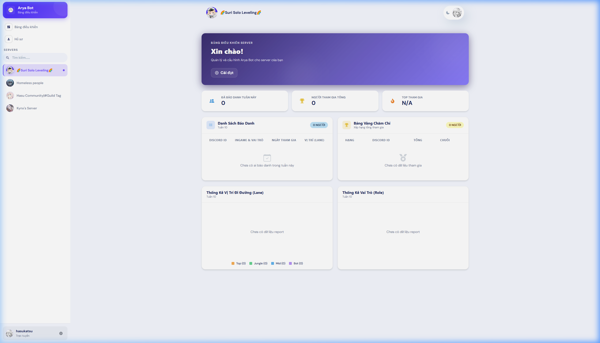
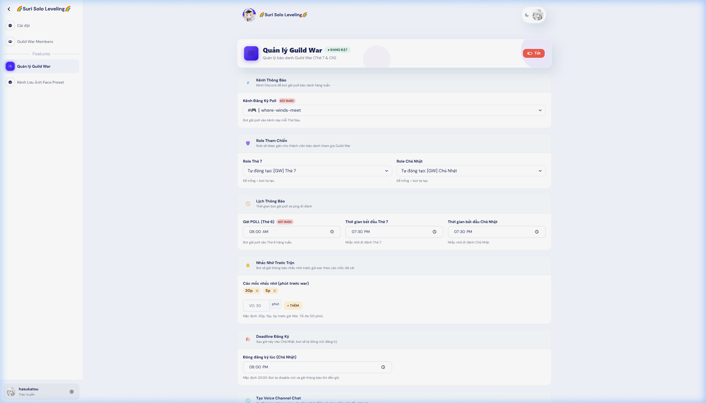
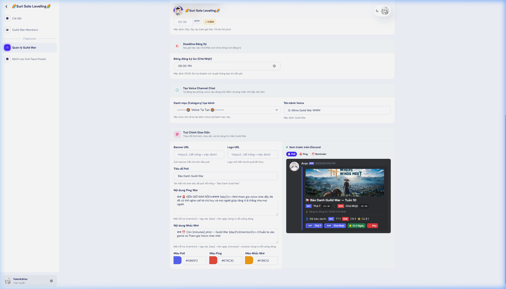
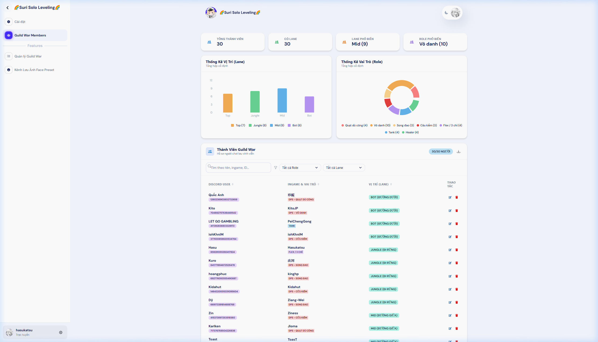

<p align="center">
  
  
  
  
  
</p>

# 🤖 Arya Bot v3

Arya là một Discord Bot đa chức năng được viết bằng **discord.js v14**, kèm **Dashboard** quản lý bằng **Next.js + Chakra UI**. Bot phục vụ cho cộng đồng game MMORPG với các tính năng nổi bật: **Guild War**, AI Chat (Gemini), quét chỉ số WWM, và nhiều tiện ích khác.

---

## 🎛️ Dashboard Preview

<p align="center">
  
  <br /><em>Tổng quan Server — Báo danh tuần, biểu đồ role/lane, bảng xếp hạng</em>
</p>

<p align="center">
  
  <br /><em>Cài đặt Guild War — Kênh, giờ war, reminder, deadline, voice channel</em>
</p>

<p align="center">
  
  <br /><em>Tuỳ chỉnh giao diện — Form bên trái, Discord Preview thời gian thực bên phải</em>
</p>

<p align="center">
  
  <br /><em>Quản lý thành viên — Stat cards, biểu đồ, tìm kiếm, lọc, sắp xếp, phân trang, sửa/xoá, xuất CSV</em>
</p>

---

## 📖 Mục Lục

- [Tính Năng](#-tính-năng)
- [Dashboard Preview](#-dashboard-preview)
- [Cấu Trúc Dự Án](#-cấu-trúc-dự-án)
- [Yêu Cầu](#-yêu-cầu)
- [Cài Đặt](#-cài-đặt)
- [Cấu Hình](#-cấu-hình)
- [Chạy Bot](#-chạy-bot)
- [Dashboard](#-dashboard)
- [Guild War System](#-guild-war-system)
- [Slash Commands](#-slash-commands)
- [Deploy (CI/CD)](#-deploy-cicd)
- [Database Schemas](#-database-schemas)

---

## ✨ Tính Năng

### 🤖 Bot Discord
| Tính năng | Mô tả |
|---|---|
| **Guild War** | Hệ thống báo danh Lãnh Địa Chiến tự động: poll hàng tuần, reminder, ping war, role tự cấp/thu hồi, voice channel tự tạo/xóa |
| **AI Chat** | Chat thông minh với Gemini AI, có bộ nhớ dài hạn per-user |
| **WWM Stats** | Quét và lưu chỉ số nhân vật Where Winds Meet |
| **Face Converter** | Chuyển đổi preset giao diện nhân vật |
| **Anime Search** | Tìm kiếm anime/phim |
| **Voice Manager** | Tạo voice channel cá nhân, quản lý qua menu tương tác |
| **Server Stats** | Tự động cập nhật kênh thống kê thành viên |

### 🎛️ Dashboard (Next.js)
| Tính năng | Mô tả |
|---|---|
| **Guild War Overview** | Bảng báo danh tuần, biểu đồ role/lane, bảng xếp hạng |
| **Guild War Members** | Quản lý hồ sơ thành viên: tìm kiếm, lọc role/lane, sắp xếp, phân trang, inline edit, xoá, xuất CSV |
| **Guild War Customization** | Tuỳ chỉnh giao diện tin nhắn với Discord Preview thời gian thực |
| **Settings** | Cấu hình Guild War (kênh, giờ war, deadline, voice channel...) |
| **Dark/Light Mode** | Giao diện tối/sáng |

---

## 📂 Cấu Trúc Dự Án

```
Arya-Bot-Ver-3/
├── .github/workflows/      # CI/CD GitHub Actions
│   └── deploy.yml           # Auto deploy to EC2
├── api/
│   └── server.js            # Express API cho Dashboard
├── dashboard/               # Next.js Dashboard
│   ├── src/
│   │   ├── api/             # API client & React Query hooks
│   │   ├── components/      # UI components (Chakra UI)
│   │   ├── config/
│   │   │   └── features/
│   │   │       └── guild-war/   # Guild War sub-components
│   │   └── pages/           # Next.js pages
│   └── package.json
├── db/
│   ├── connect.js           # MongoDB connection
│   └── schemas.js           # Mongoose schemas
├── docs/
│   └── preview/             # Dashboard screenshots
├── modules/
│   ├── commands/            # Slash commands
│   ├── contexts/            # Context menu commands
│   └── events/              # Discord event handlers
├── services/
│   └── guildWar/            # Guild War core logic
│       ├── index.js         # Scheduler & cron
│       ├── builders.js      # Discord message builders
│       ├── buttonHandler.js # Button interaction handler
│       └── helpers.js       # Constants & utilities
├── utils/                   # Tiện ích chung
├── index.js                 # Entry point
├── .env.example             # Template biến môi trường
└── package.json
```

---

## 📋 Yêu Cầu

- **Node.js** >= 18
- **MongoDB** (Atlas hoặc local)
- **pnpm** (cho Dashboard)
- **PM2** (production, khuyên dùng)
- **Discord Bot Token** + Application với các Intent: `Guilds`, `GuildMembers`, `GuildMessages`, `MessageContent`, `GuildVoiceStates`, `GuildPresences`

---

## 🔧 Cài Đặt

```bash
# 1. Clone repo
git clone https://github.com/KhoaDayy/Arya-Bot-Ver-3.git
cd Arya-Bot-Ver-3

# 2. Cài dependencies cho Bot
npm install

# 3. Cài dependencies cho Dashboard
cd dashboard
npm install -g pnpm
pnpm install
cd ..

# 4. Tạo file .env
cp .env.example .env
# → Điền thông tin vào .env
```

---

## ⚙️ Cấu Hình

Tạo file `.env` từ `.env.example`:

```env
# === Bắt buộc ===
TOKEN=                          # Discord Bot Token
CLIENT_ID=                      # Discord Application ID
GUILD_ID=                       # Server ID chính (dev mode)
OWNER_ID=                       # Discord User ID của chủ bot
MONGODB_URI=                    # MongoDB connection string
GEMINI_API_KEY=                 # Google Gemini AI API Key

# === Mode ===
MODE=dev                        # dev = đăng ký command cho 1 guild, prod = global

# === Tuỳ chọn ===
API_PORT=3001                   # Port cho Dashboard API
DASHBOARD_API_KEY=              # API Key bảo vệ Dashboard
DASHBOARD_URL=                  # URL Dashboard cho CORS
```

---

## 🚀 Chạy Bot

### Development
```bash
# Bot
node index.js

# Dashboard (terminal khác)
cd dashboard
pnpm dev
```

### Production (PM2)
```bash
# Bot
pm2 start index.js --name "arya-bot-v3"

# Dashboard
cd dashboard
pnpm build
pm2 start "pnpm start" --name "arya-dashboard"

pm2 save
```

---

## 🎛️ Dashboard

Dashboard chạy trên **Next.js 13** + **Chakra UI**, giao tiếp với Bot qua REST API (`api/server.js` port 3001).

| Route | Mô tả |
|---|---|
| `/guilds/[id]` | Guild War Overview — báo danh tuần, biểu đồ, bảng xếp hạng |
| `/guilds/[id]/gw-members` | Quản lý thành viên GW — tìm kiếm, lọc, sắp xếp, sửa/xoá, xuất CSV |
| `/guilds/[id]/features/guiwar` | Cài đặt & Tuỳ chỉnh Guild War |
| `/guilds/[id]/settings` | Cài đặt chung |

### API Endpoints

| Method | Endpoint | Mô tả |
|---|---|---|
| `GET` | `/api/guiwar/:guildId/list` | Danh sách báo danh tuần hiện tại |
| `GET` | `/api/guiwar/:guildId/members` | Danh sách thành viên cố định |
| `PATCH` | `/api/guiwar/:guildId/members/:userId` | Cập nhật thông tin thành viên |
| `DELETE` | `/api/guiwar/:guildId/members/:userId` | Xoá thành viên |
| `POST` | `/api/guiwar/:guildId/lane` | Cập nhật vị trí đi đường |
| `GET` | `/api/guiwar/:guildId/rank` | Bảng xếp hạng |

---

## ⚔️ Guild War System

Hệ thống Guild War hoạt động **tự động hoàn toàn** qua cron job:

### Workflow hàng tuần
```
Thứ 6 (pollTime)     → Gửi poll báo danh với 4 nút: T7 / CN / Cả 2 / Hủy
Thứ 7 (timeT7 - 30m) → Tạo Voice Channel + Reminder
Thứ 7 (timeT7)       → Ping War, disable nút T7
Chủ Nhật (timeCN)     → Ping War CN
Chủ Nhật (deadline)   → Đóng đăng ký, disable tất cả nút
Chủ Nhật 23:59        → Thu hồi role, archive poll
```

### Schemas
- **GuildWarConfig** — Cấu hình per-guild (kênh, giờ, role, customization...)
- **GuildWarMember** — Hồ sơ cố định (ingame name, role, lane) — đăng ký 1 lần
- **GuildWarRegistration** — Dữ liệu báo danh theo tuần (ngày tham gia)
- **GuildWarStats** — Thống kê tham gia (tổng trận, chuỗi liên tiếp)

### Đăng ký cố định vs Báo danh tuần
```
/gw-register          → Nhập tên ingame + vai trò (1 lần, lưu vĩnh viễn)
Poll Button (T7/CN)   → Báo danh tuần này (dùng info đã register)
```

---

## 📜 Slash Commands

| Command | Mô tả |
|---|---|
| `/ask` | Chat với Gemini AI (có bộ nhớ) |
| `/gw-register` | Đăng ký hồ sơ Guild War cố định |
| `/guiwar-setup` | Cấu hình Guild War cho server |
| `/guiwar-force-start` | Gửi poll báo danh ngay lập tức |
| `/guiwar-force-ping` | Ping war thủ công |
| `/guiwar-force-voice` | Tạo voice channel thủ công |
| `/guiwar-reset-week` | Reset dữ liệu tuần hiện tại |
| `/wwm-stats` | Xem/cập nhật chỉ số WWM |
| `/ani-search` | Tìm kiếm anime |
| `/face-converter` | Chuyển đổi preset giao diện |
| `/face-lookup` | Tra cứu preset đã lưu |
| `/player-lookup` | Tra cứu thông tin người chơi |
| `/avatar` | Xem avatar người dùng |
| `/ping` | Xem latency bot |
| `/help` | Danh sách lệnh |
| `/text-color` | Tạo text màu ANSI |
| `/setup` | Cấu hình voice channel |
| `/setbot` | Cấu hình trạng thái bot |
| `/reload` | Reload command (owner) |
| `/restart` | Khởi động lại bot (owner) |

---

## 🚢 Deploy (CI/CD)

Bot sử dụng **GitHub Actions** để tự động deploy lên **AWS EC2** khi push vào nhánh `dev-v3`.

### Secrets cần cấu hình trên GitHub
| Secret | Mô tả |
|---|---|
| `AWS_EC2_HOST` | IP/Domain của EC2 instance |
| `AWS_EC2_USERNAME` | SSH username (thường là `ubuntu`) |
| `AWS_EC2_SSH_KEY` | Private SSH key |

### Quy trình deploy
1. Push code lên nhánh `dev-v3`
2. GitHub Actions SSH vào EC2
3. `git pull` → `npm install` → Build Dashboard → Restart PM2

---

## 🗄️ Database Schemas

| Collection | Mô tả |
|---|---|
| `VoiceTemplate` | Template voice channel per-guild |
| `VoiceParent` | Mapping voice channel → parent |
| `VoiceUser` | Tên voice channel tùy chỉnh per-user |
| `FacePreset` | Preset giao diện nhân vật |
| `GuildConfig` | Cấu hình guild chung |
| `Conversation` | Lịch sử chat AI per-user |
| `WwmStats` | Chỉ số WWM per-user per-weapon |
| `GuildWarConfig` | Cấu hình Guild War per-guild |
| `GuildWarMember` | Hồ sơ GW cố định (ingame, role, lane) |
| `GuildWarRegistration` | Báo danh GW theo tuần |
| `GuildWarStats` | Thống kê tham gia GW |

---

## 📄 License

ISC

---

<p align="center">
  Made with ❤️ by <strong>KhoaDayy</strong>
</p>
